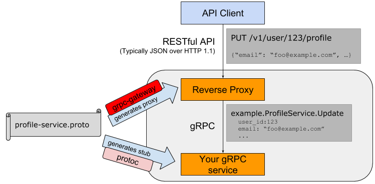

# grpc使用教程
## 第一步：定义protobuf文件
```protobuf
syntax = "proto3";

package productinfo

option go_package = "ucp/product";

service productInfo {
  rpc getProduct(productId) returns (product);
  rpc addProduct(product) returns (productId);
}

message productId {
  string value = 1;
}

message product {
  string id = 1;
  string name = 2;
  string desc = 3;
  float price = 4;
}
```

## 第二步：使用protoc命令生成go代码
```bash
cd unary/pb
protoc --go_out=.\ --go-grpc_out=.\ .\product_info.proto
```

## 第三步：生成服务端和客户端可执行程序
```bash
cd server # 进入server文件夹
go build -v -o ../bin/server.exe #生成服务端可执行文件
cd client # 进入client文件夹
go build -v -o ../bin/client.ext #生成客户端的可执行文件
```

先运行服务端可执行文件，后执行客户端可执行文件：
```bash
cd ../bin
./server.exe
```

>2023/05/23 23:55:38 Server listening on [::]:50052
2023/05/23 23:55:53 AddProduct id:"193616468358980182203562924772" name:"Product 1" desc:"Product 1 desc" price:100
2023/05/23 23:55:53 GetProduct 193616468358980182203562924772
2023/05/23 23:55:58 AddProduct id:"232120844655576178144389321985" name:"Product 1" desc:"Product 1 desc" price:100
2023/05/23 23:55:58 GetProduct 232120844655576178144389321985

```bash
cd ../bin
./client.exe
```

>2023/05/23 23:55:53 ProductId : value:"193616468358980182203562924772"
2023/05/23 23:55:53 Product : id:"193616468358980182203562924772" name:"Product 1" desc:"Product 1 desc" price:100
2023/05/23 23:55:58 ProductId : value:"232120844655576178144389321985"
2023/05/23 23:55:58 Product : id:"232120844655576178144389321985" name:"Product 1" desc:"Product 1 desc" price:100

# grpc网关服务
gRPC 网关插件能够让protocol buffers 编译器读取gRPC 服务定义，并生成反向代理服务器端，该服务器端能够将RESTful JSON API 翻译为gRPC。



改写之前的pb文件，使其增加网关功能：
```protobuf
syntax = "proto3";

import "google/api/annotations.proto";

package productInfo;

option go_package = "genproto/product_info";

service productInfo {
  rpc getProduct(productId) returns (product) {
    option (google.api.http) = {
      get: "/v1/products/{id}"
    };
  }
  rpc addProduct(product) returns (productId) {
    option (google.api.http) = {
      post: "/v1/products"
      body: "*"
    };
  }
}

message productId {
  string value = 1;
}

message product {
  string id = 1;
  string name = 2;
  string desc = 3;
  float price = 4;
}
```
在生成对应的服务端和客户端代码之前，需要先安装一些依赖，在项目根目录下执行以下命令安装依赖：
```bash
$ go get -u github.com/grpc-ecosystem/grpc-gateway/protoc-gen-grpc-gateway
$ go get -u github.com/grpc-ecosystem/grpc-gateway/protoc-gen-swagger
$ go get -u google.golang.org/protobuf
```